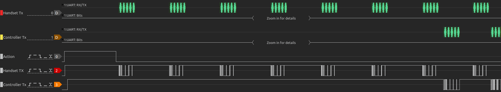

# desk controller

This is the code and hardware details for a WiFi/Bluetooth Man-in-the-Middle controller for an AOKE Wistopht WP-CB01-901 32.5 standing desk controller.

The project is educational only. If you do not know what you are doing, do not use this document as a how-to. Using the device described here will almost certainly void your desk's warranty.

## Controls

### HTTP

The controller will be visible as `desk` in your LAN. It exposes HTTP endpoints.

Endpoints:
- `PUT /move_to/?position=<pos>`: `<pos>` is `1`, `2`, `3` or `4` corresponding to the programmed memory heights for the desk
- `GET /height/`: returns height of desk

Due to the protocol used by the desk, the height endpoint may return the last programmed memory height instead of the actual desk height.

### Bluetooth

Bluetooth is not yet implemented due to platform limitations.

## Building

Install `tinygo` version 0.34.0+ and then:

If building for HTTP control, write your SSID into wifi/ssid.text and your WiFi password into wifi/password.text. Do not add a final newline to the files.

`tinygo flash -target pico-w -stack-size=8kb .` at the root of the repo with the target Raspberry Pi Pico W attached to a USB port.

Attach the handset to the Handset RJ45 socket on the board and a **non-crossover** Cat5 cable from the controller to the Controller RJ54 on the board. Provide USB 5V power to the Raspberry Pi Pico.

## Circuit


RJ45 pinout:

1. brown — Controller UART Rx
2. red — Controller UART Tx
4. yellow — button pressed (do action), also required during initialisation (16ms pulse to start communication)
5. white — GND
8. black — +5V

UART is 9600 baud.

## Protocol

The communication protocol used by the desk controller is based on 5-byte packets. The initial header byte distinguishes Controller-to-Handset from Handset-to-Controller packets, this is followed by 3 content bytes and then a single checksum byte.

The checksum byte is a literal checksum of the content bytes; 1st+2nd+3rd ignoring carry.

### Controller-to-Handset

Header byte: `0x5a`, followed by 3 digits encoded based according to the bits required to specify the segments of a 7+1 segment display.

7-segment display:
```
  -5-
|     |
2     6
|     |
  -1-
|     |
3     7
|     |
  -4-   0
```

Digits:
```
0 = 0x3f  0. = 0xbf
1 = 0x06  1. = 0x86
2 = 0x5b  2. = 0xdb
3 = 0x4f  3. = 0xcf
4 = 0x66  4. = 0xe6
5 = 0x6d  5. = 0xed
6 = 0x7d  6. = 0xfd
7 = 0x07  7. = 0x87
8 = 0x7f  8. = 0xff
9 = 0x6f  9. = 0xef
```

Additional codes:
```
R = 0x77
T = 0x78
E = 0x79
```

`E` is used for error codes, and `R`/`T` are used in conjunction with `5` to indicate reset.

Note that the encodings for `4` and `E` do not actually match the segments that are illuminated. ¯\\\_(ツ)\_/¯

This encoding [matches](https://web.archive.org/web/20211224215036/https://twitter.com/_kortschak/status/1474495857814769666) the [2021 day 8 Advent of Code problem](https://adventofcode.com/2021/day/8).

### Handset to Controller

Header byte: `0xa5`, followed by a zero, an button press coded as bits of a byte, a byte that ensures that the checksum will be `0xff`, and then the checksum.

Button encoding:
```
bit: 7654 3210
key:  DU4 321M
```

When a button is pressed, the yellow wire (line 4 of the RJ45 connector) goes high.

### Handshake

On start-up the yellow wire (RJ45 line 4) is made high by the handset for 16ms and then the handset and controller UART Tx lines are enabled. The handset then chirps a number of `a50000ffff` packets at 10ms intervals and waits for a controller response of a single `5a00000000` and then continued `5a<height><checksum>` packets. If this does not happen after some long period, the controller and handset appear to go into an error state.



### Watchdog

At 18 minutes after the last button action packet sent to the controller by the handset, the controller sends a single `5afffffffd` packet. After this, actions sent to the controller will fail with an E04 error. This can be reset by a physical handset button press, but not by packets sent by the remote controller. The issue can be mitigated until the protocol is more fully understood by chirping five `a500609fff` packets before the watchdog time elapses. This packet is a `du-----` button action; resetting the watchdog timer, leaving the desk in the current position and refreshing the remote controller's knowledge of the desk's height.

## Limitations

The handshaking protocol between the linear actuator controller and the handset is has not been possible to properly implement for the handset side via the remote controller, so it is not handled at all. After power-up, it may be necessary to momentarily press a controller button and then wait for the display to turn off. After this, the remote controller will work.

The connection between the linear actuator controller and the handset carries +5V, but it does not appear to deliver enough current to support the remote controller. So power is delivered to the remote controller by USB.